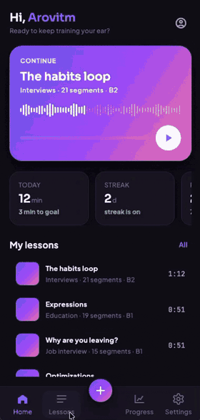

# Shado

A cross-platform Flutter app for learning English with the **shadowing**
technique: listen to a short phrase, repeat it after the speaker, loop until it
sounds right.

You upload audio and its transcript, cut it into segments on a waveform editor,
then practise segment by segment with looping, speed control and translation.

<p align="center">
  
</p>

- **Platforms:** Android · iOS · Windows · macOS · Linux
- **Backend:** [shado_server](https://github.com/martynov-lab/shado_server)
- **Status:** personal project in active development

## Features

- **Lesson editor** — upload an audio file, paste the text, place segment
  boundaries on a zoomable waveform (mouse, trackpad and touch gestures).
- **Shadowing player** — play, loop and select ranges of adjacent segments,
  0.5×–1.5× speed, full keyboard control on desktop, lock-screen and
  notification controls via a system media session.
- **AI voice-over** — generate audio for a text with text-to-speech and a
  choice of voice and accent.
- **Translation** of each segment into the learner's language.
- **Library and folders** — personal lessons, public lessons, topics and
  filters.
- **Progress** — daily goal, streaks, minutes per day, activity heatmap,
  achievements.
- **Accounts and roles** — email sign-in, silent token refresh, admin screens
  for user roles and topics.
- **Adaptive UI** — separate mobile, tablet and desktop layouts, light and dark
  themes, a custom design system.

## Tech stack

| Area | Tools |
| --- | --- |
| Language | Dart 3 (records, patterns, sealed classes) |
| UI | Flutter, custom design system, go_router |
| Screens | Elementary (MVVM: Widget + WidgetModel + Model) |
| DI and shared state | Riverpod 3 |
| Models | freezed, json_serializable |
| Network | dio with an auth interceptor |
| Storage | sqflite / sqflite_common_ffi, flutter_secure_storage |
| Audio | just_audio, just_audio_media_kit, audio_service, flutter_soloud |
| Testing | flutter_test, widget tests, integration tests |

## Architecture

Clean architecture, feature-first; dependencies point inward:
`presentation → domain ← data`.

```text
lib/
  core/        network, storage, router, audio, platform setup
  di/          Riverpod providers: services, repositories, use cases
  theme/       design tokens: colors, spacing, typography, motion
  widgets/     design system components
  features/
    auth/ admin/ home/ languages/ lessons/ progress/ settings/
      domain/        entities, repository interfaces, use cases, services
      data/          DTOs, data sources, repository implementations
      presentation/  screens (page + widget model + model), widgets
```

The domain layer has no Flutter, network or database imports, so business
rules and screen models are tested against fakes.

## Engineering highlights

- **Offline-first audio.** Shadowing loops 2–3 second clips, so audio is
  played from a local copy, not streamed. Files are cached by id and verified
  with `sha256`; the server deduplicates uploads by the same checksum.
- **Server as the source of truth, sqflite as a cache.** Delta sync by
  `updated_at`, soft deletes propagated to other devices.
- **Safe writes.** Lessons are created with an idempotent `PUT` on a
  client-generated UUID, so a retry never duplicates them. Edits use `If-Match`;
  a version conflict surfaces to the user instead of overwriting another
  device's changes.
- **Auth.** A 15-minute access token refreshed silently; parallel `401`s share
  one refresh; a rejected refresh clears the session, cache and audio.
- **Desktop support.** Where plugins have no Windows/Linux implementation,
  platform-specific replacements are wired in at startup (libmpv for playback,
  FFI sqlite, miniaudio for waveform peaks).
- **Custom waveform editor.** Zoom and pan, draggable boundary markers with
  unambiguous gestures, a time ruler and a playback playhead.

## Testing

330+ tests run without a network:

- domain: segment splitting, boundary normalisation, range selection rules,
  progress and streak math;
- data: DTO parsing, every API error code, retries of idempotent requests only,
  token refresh under concurrent requests, sync and version conflicts;
- presentation: screen models and widget tests (waveform gestures, navigation,
  theme switching).

A separate contract test runs the full flow against a live server, and
integration tests check the desktop audio pipeline on a real platform.

```bash
flutter test
flutter test integration_test/desktop_pipeline_test.dart -d windows
```

## Running

```bash
flutter pub get
dart run build_runner build --force-jit   # freezed + json_serializable
flutter run --dart-define=SHADO_API_BASE_URL=http://10.0.2.2:8080
```

`SHADO_API_BASE_URL` points to a running
[shado_server](https://github.com/martynov-lab/shado_server). `10.0.2.2` is
the host machine from the Android emulator; use `127.0.0.1` on the iOS
simulator and desktop.

## License

[MIT](LICENSE)
